# Covid-19 Cases Data Analysis in Europe

## Overview
This project focuses on analyzing the spread and impact of COVID-19 across European countries using publicly available datasets. 
The goal is to uncover insights from the pandemic data through data preprocessing, visualization, and time-series analysis.

## Table of contents

## Architecture

## Project Structure

- 📂 **PhoenixPhungNguyen-covid19-adf/**
  - 📄 README.md
  - 📄 publish_config.json
  - 📂 images/
  - 📂 dataflow/   
  - 📂 dataset/    
  - 📂 factory/
  - 📂 linkedService/
  - 📂 pipeline/
  - 📂 trigger/

## Data Source
Covid 19 Data in Europe from website https://www.ecdc.europa.eu/en

## Tech Stack
**1. Azure Data Factory**

-    Linked Service
Create linked service to connect ADF with Azure Data Lake Storage Gen2

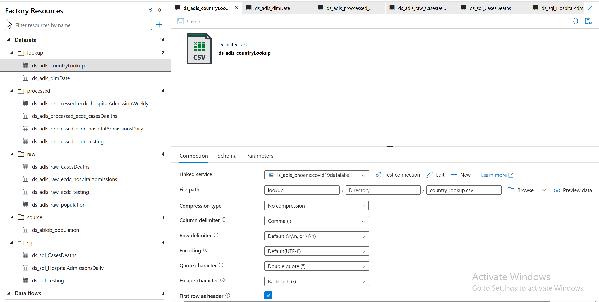
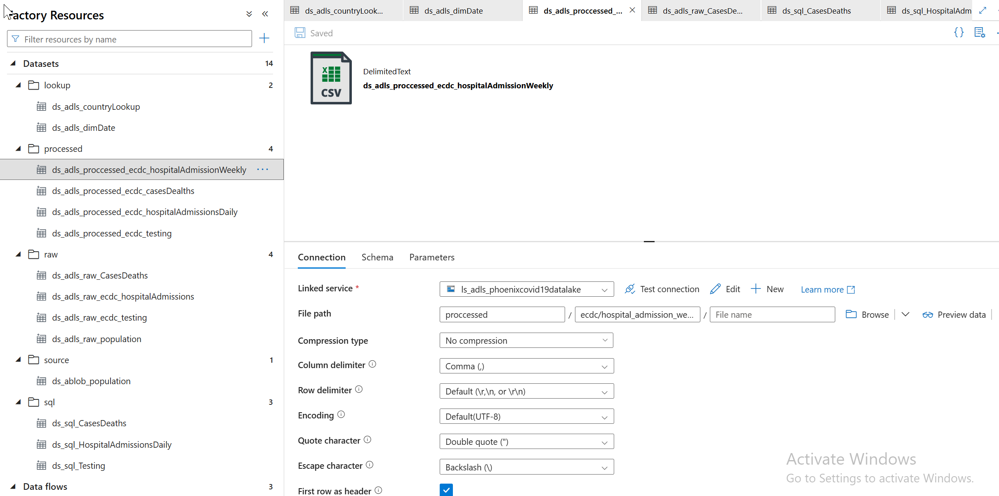
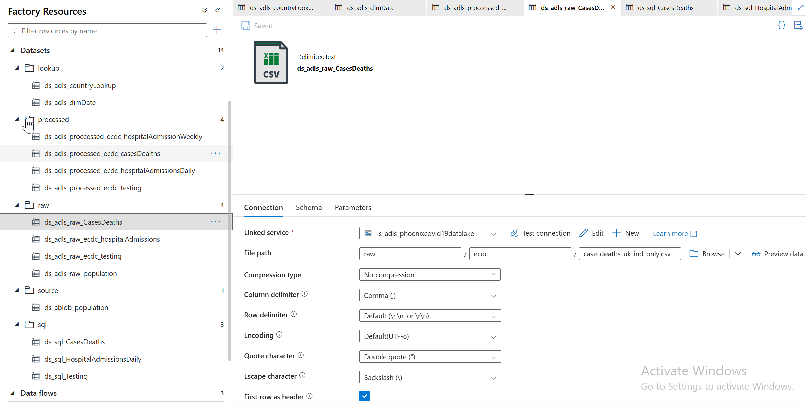

Create linked service to connect ADF with Azure Blob Storage

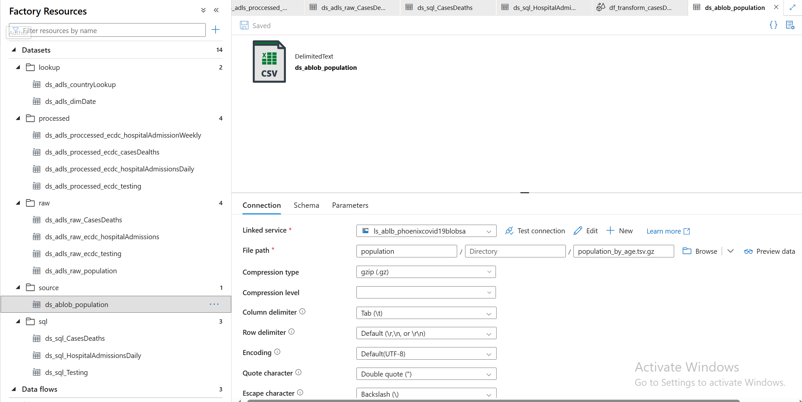

Create linked service to connect ADF with Azure SQL Database

-  Create new dataset

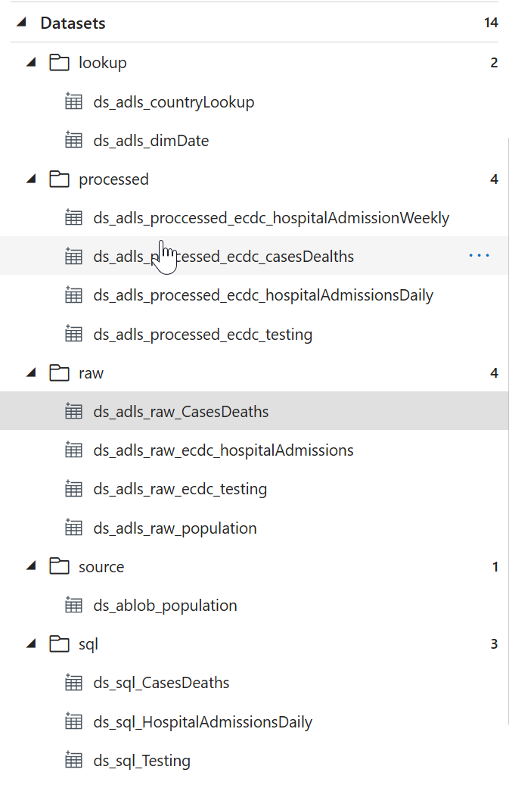

-    Pipelines : ingest population, load case deaths, hospital admissions, testing, process population,case deaths, hospital admission, testing data
  

      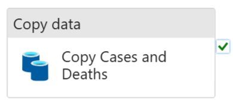
      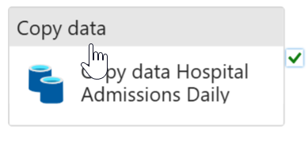
      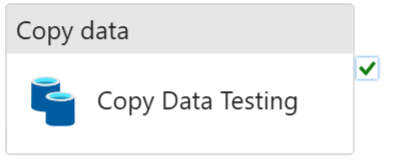

 
 
 
 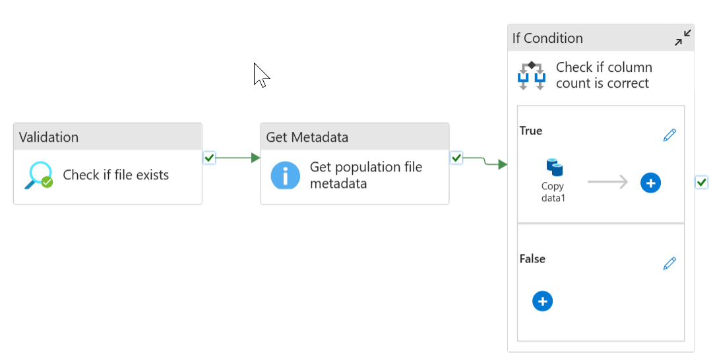
  
-    Data flows : Transform case dealths, hospital admissions and testing data
  

   
      
      
      
      

- Trigger:

  
  
**2. Azure Databricks** 

- Workspace:
  
   
- Compute:
  
   

**3. Azure Data Lake Gen 2**

- resource group
  
  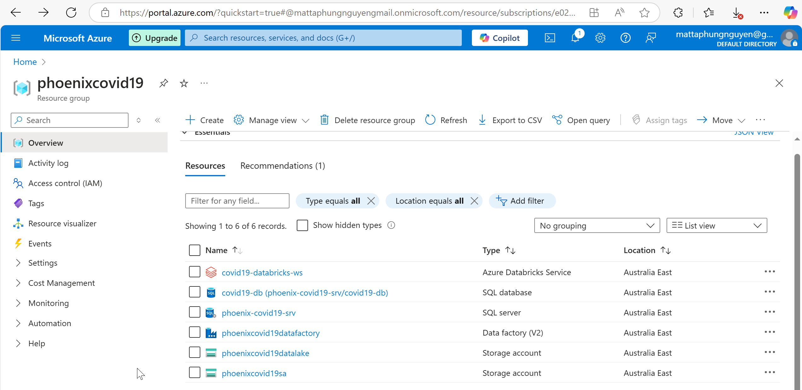
- raw
 

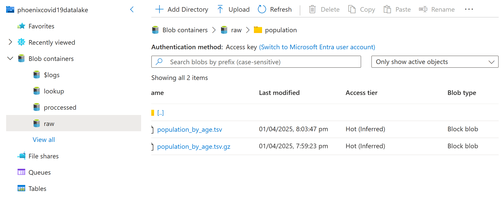

-lookup

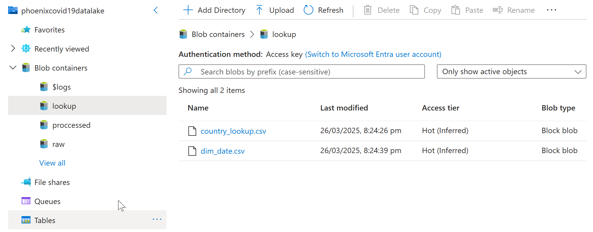
- process
  

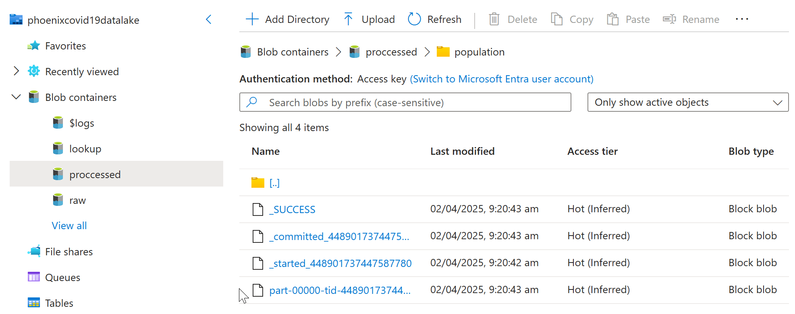

**4. Azure SQL DB**
- Create access control (IAM) and add role assignment
  

**5. Power BI**

- **Covid trends by country**
  

- **Covid testing cases**
  

 

