# Covid-19 Cases Data Analysis in Europe

## Overview
This project analyzes the spread and impact of COVID-19 across European countries using publicly available datasets.  
The goal is to uncover insights through data preprocessing, transformation, visualization, and time-series analysis.

---
## Table of Contents
1. [Overview](#overview)  
2. [Architecture](#architecture)  
3. [Project Structure](#project-structure)  
4. [Data Source](#data-source)  
5. [Tech Stack](#tech-stack)  
   - Azure Data Factory  
   - Azure Databricks  
   - Azure Data Lake Gen2  
   - Azure SQL Database  
   - Power BI  
6. [Setup & Installation](#setup--installation)  
7. [Data Pipeline Workflow](#data-pipeline-workflow)  
8. [Data Transformation](#data-transformation)  
9. [Challenges & Solutions](#challenges--solutions)  
10. [Contributors](#contributors)  
---

## Architecture
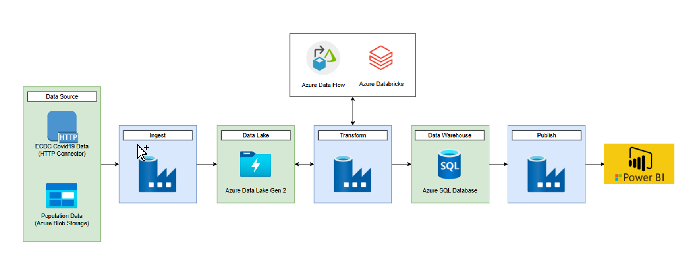

---

## Project Structure
- 📂 **PhoenixPhungNguyen-covid19-adf/**
  - 📄 README.md
  - 📄 publish_config.json
  - 📂 images/
  - 📂 dataflow/   
  - 📂 dataset/    
  - 📂 factory/
  - 📂 linkedService/
  - 📂 pipeline/
  - 📂 trigger/

---

## Data Source
COVID-19 data in Europe from the [ECDC website](https://www.ecdc.europa.eu/en).

ECDC:
- Confirmed cases
- Mortality
- Hospitalization/ ICU Cases
- Testing Numbers

Eurostat:
- Population by age

## Data Lake
Contains these data:
- Confirmed cases
- Mortality
- Hospitalization/ ICU Cases
- Testing Numbers
- Country’s population by age group

## Data Warehouse
Contains these data:
- Confirmed cases
- Mortality
- Hospitalization/ ICU Cases
- Testing Numbers

## Data Pipeline Workflow

**Ingestion:**  
- Fetch COVID-19 data from ECDC and upload to Azure Blob Storage  
- Move data into Azure Data Lake Gen2 (RAW zone)  

**Storage:**  
- Organize data into layers: Raw → Lookup → Process  

**Transformation:**  
- Use ADF Dataflows for initial cleaning  
- Use Databricks (Spark) for advanced processing & enrichment  

**Load:**  
- Load the processed data into Azure SQL Database  

**Visualization:**  
- Connect Power BI to SQL DB for interactive dashboards
  
---
## Data Transformation
- Clean missing values  
- Aggregate daily data into weekly/monthly summaries  
- Join with population data to calculate per-capita metrics  
- Create derived metrics: positivity rate, hospitalization rate, mortality rate
  
  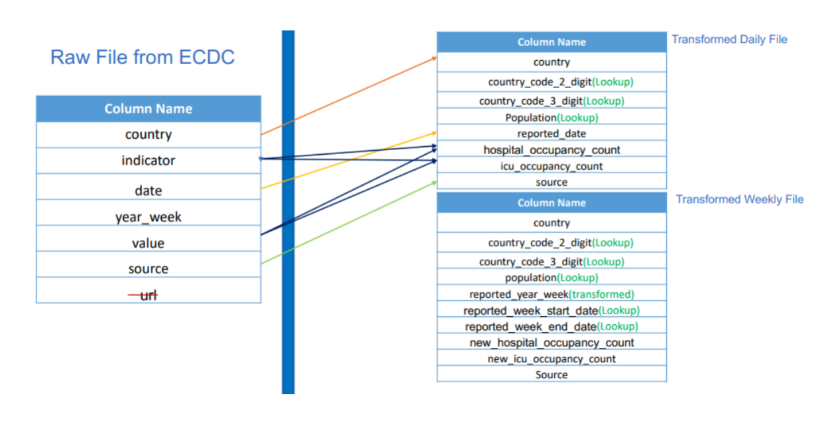
  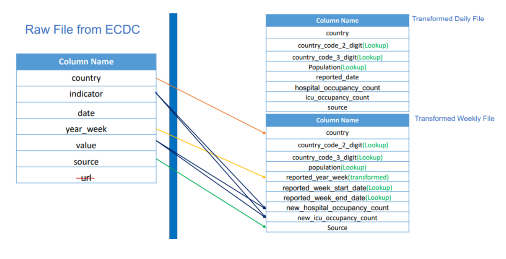
  
  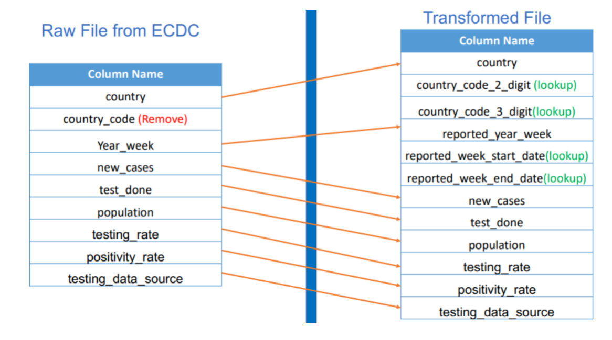
--- 
## Tech Stack
### 1. Azure Data Lake Gen2
Organized into raw, lookup, and process layers.  
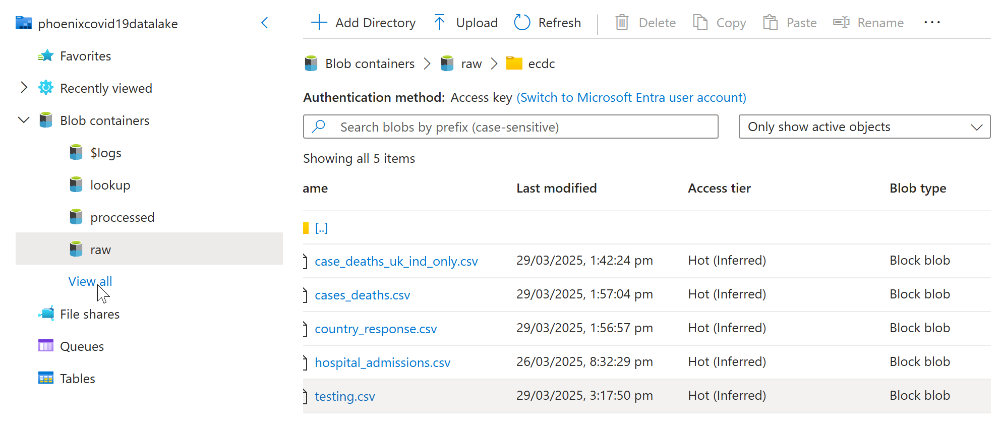  
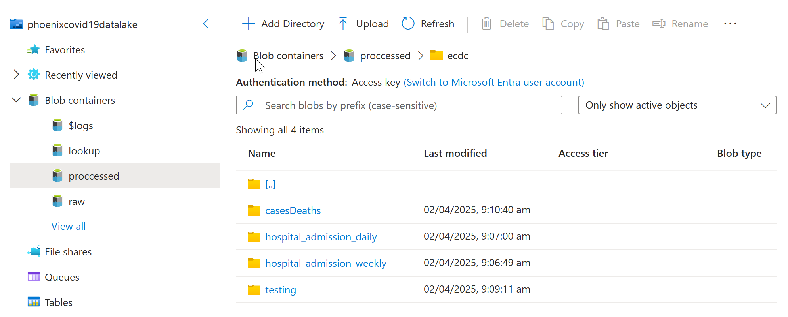

### 2. Azure Data Factory
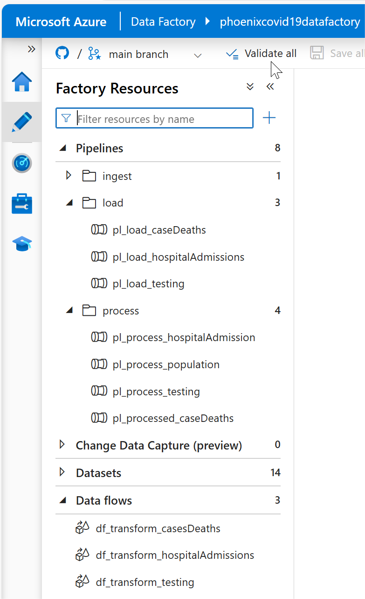

- **Linked Services**: connect to ADLS Gen2, Blob Storage, and Azure SQL Database.
  
- **Datasets**: raw, lookup, process datasets.
   
- **Pipelines**
    
    Ingest population, load case deaths, hospital admissions, and testing.

    

      
Case Deaths Pipeline

      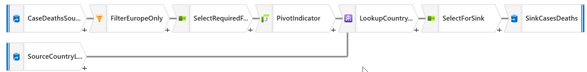
    

    

      
Hospital Admissions Pipeline

      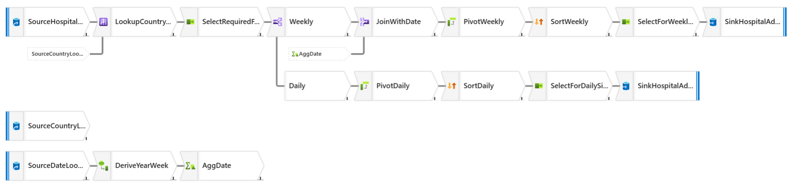
    

    

      
Testing Pipeline

      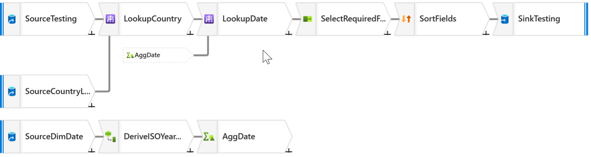
    

- **Dataflows**: transformations for case deaths, hospital admissions, testing.
  

   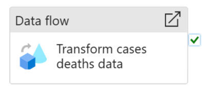
   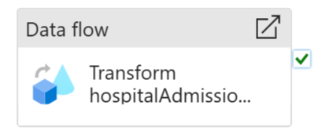
   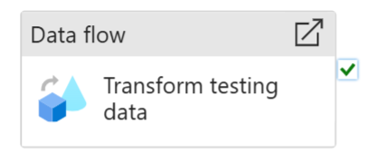

- **Triggers**: orchestrating daily runs.

    - **Type:** Schedule trigger (daily at 6 AM)  
    - **Purpose:** Automatically run all data pipelines (Population, Case Deaths, Hospital Admissions, Testing)  
    - **Integration:** Each pipeline runs a Databricks notebook and updates Azure SQL Database  
    - **Screenshot:**  
      

        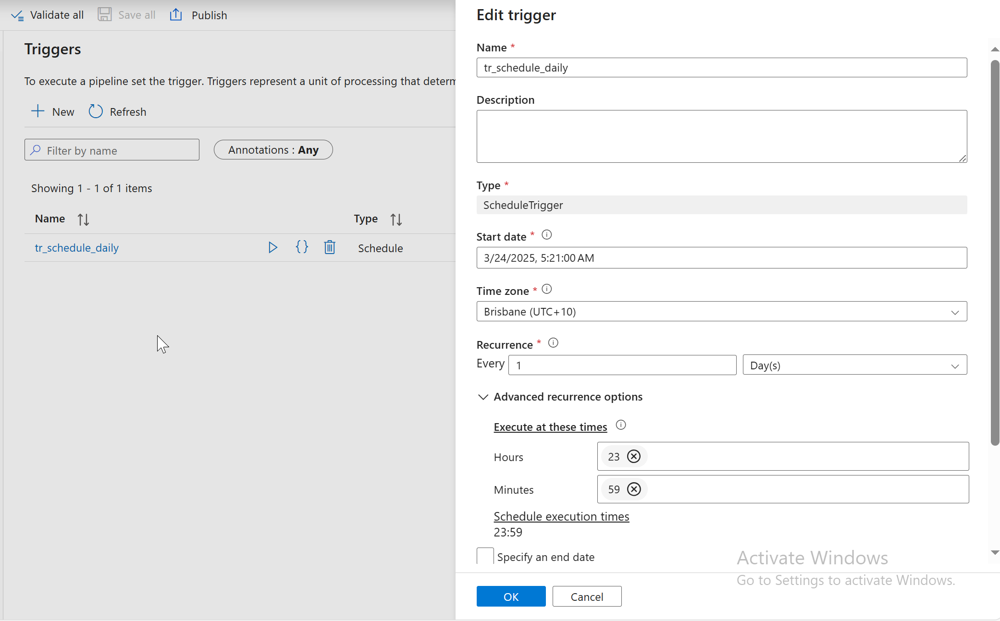
      

### 3. Azure Databricks

  
Compute

  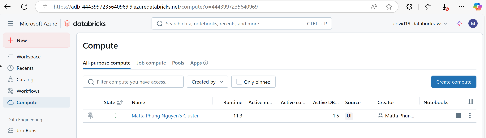

  
Workspace

  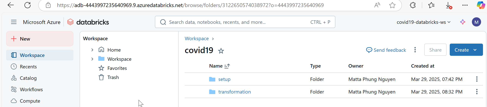

  
Population

  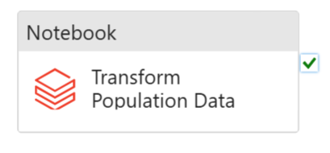

### 4. Azure SQL Database
- **Access Control(IAM)**
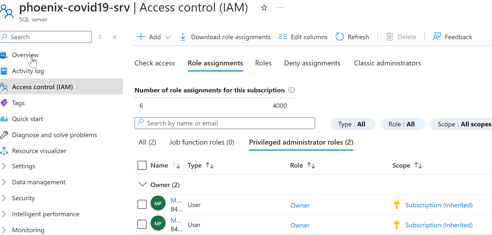
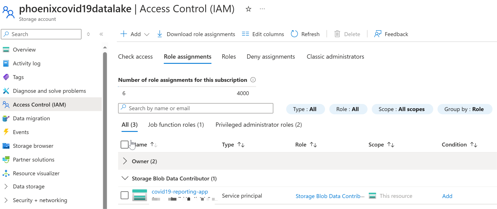

- **Data loaded into SQL DB for querying and analysis.**  
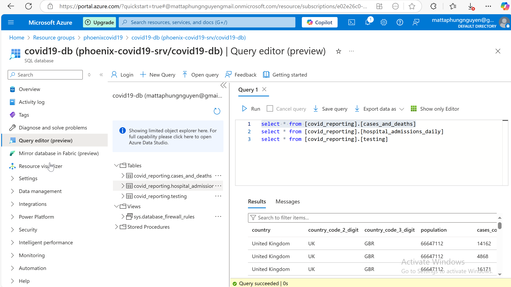

### 5. Power BI
Interactive dashboards for trends, testing, and country-level analysis.  
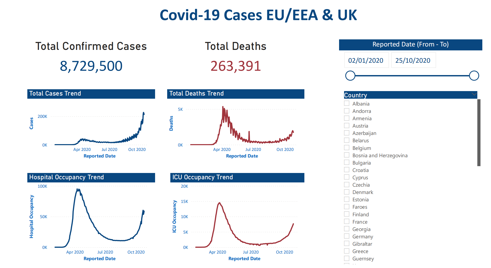  
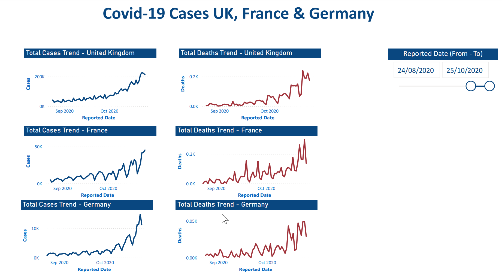  
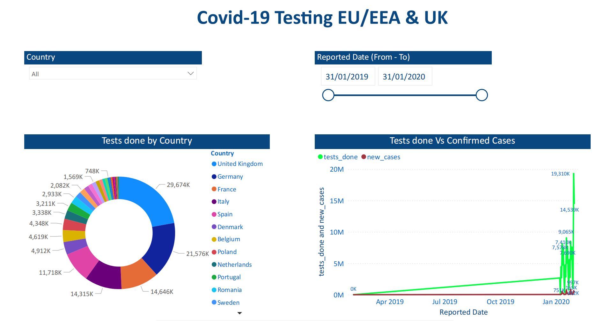  

---
## Setup & Installation
1. Clone the repository:
git clone https://github.com/yourusername/PhoenixPhungNguyen-covid19-adf.git

2. Upload datasets into Azure Data Lake Gen2:
- /raw/covid19/
- /raw/population/
- /lookup/
- /process/

3. Import Azure Data Factory pipelines from /pipeline folder into Azure Portal  
4. Import Databricks notebooks into workspace  
5. Configure Azure SQL Database connection in ADF  
6. Open Power BI Dashboard in /powerbi to visualize insights

---

## Challenges & Solutions
- **Missing values in datasets** → Handled using Spark to fill nulls with averages or forward fill.
- **Large datasets with multiple CSV files** → Optimized with partitioning in Azure Data Lake Gen2.
- **Pipeline failures due to connection issues** → Configured retry policy in Azure Data Factory.
- **Slow Power BI reports** → Created pre-aggregated tables in Azure SQL DB to improve performance.
---

## Contributors
👤 **Thi Minh Phung Nguyen (PhoenixNguyen)**  
Data Engineer | SQL | Python | Azure | Power BI

