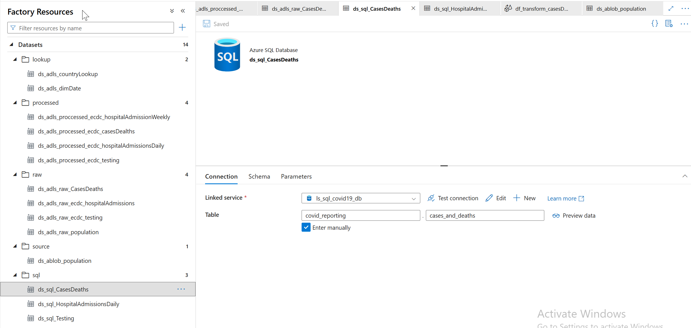
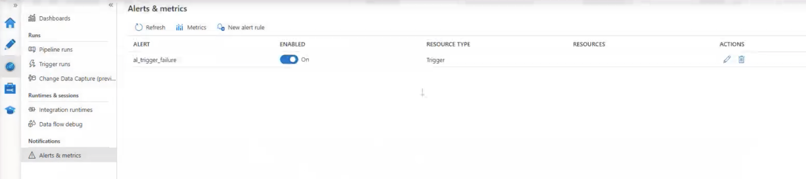
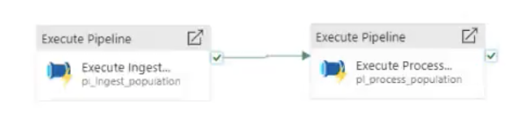

# Covid-19 Cases Data Analysis in Europe

## Overview
This project analyzes the spread and impact of COVID-19 across European countries using publicly available datasets.  
The goal is to uncover insights through data preprocessing, transformation, visualization, and time-series analysis.

---
## Table of Contents
1. [Overview](#overview)  
2. [Architecture](#architecture)  
3. [Project Structure](#project-structure)  
4. [Data Source](#data-source)  
5. [Tech Stack](#tech-stack)  
   - Azure Data Factory  
   - Azure Databricks  
   - Azure Data Lake Gen2  
   - Azure SQL Database  
   - Power BI  
6. [Setup & Installation](#setup--installation)  
7. [Data Pipeline Workflow](#data-pipeline-workflow)  
8. [Data Transformation](#data-transformation)  
9. [Challenges & Solutions](#challenges--solutions)  
10. [Contributors](#contributors)  
---

## Architecture

---

## Project Structure
- 📂 **PhoenixPhungNguyen-covid19-adf/**
  - 📄 README.md
  - 📄 publish_config.json
  - 📂 images/
  - 📂 dataflow/   
  - 📂 dataset/    
  - 📂 factory/
  - 📂 linkedService/
  - 📂 pipeline/
  - 📂 trigger/

---

## Data Source
COVID-19 data in Europe from the [ECDC website](https://www.ecdc.europa.eu/en).

ECDC:
- Confirmed cases
- Mortality
- Hospitalization/ ICU Cases
- Testing Numbers

Eurostat:
- Population by age

## Data Lake
Contains these data:
- Confirmed cases
- Mortality
- Hospitalization/ ICU Cases
- Testing Numbers
- Country’s population by age group

## Data Warehouse
Contains these data:
- Confirmed cases
- Mortality
- Hospitalization/ ICU Cases
- Testing Numbers

## Data Pipeline Workflow

**Ingestion:**  
- Fetch COVID-19 data from ECDC and upload to Azure Blob Storage  
- Move data into Azure Data Lake Gen2 (RAW zone)  

**Storage:**  
- Organize data into layers: Raw → Lookup → Process  

**Transformation:**  
- Use ADF Dataflows for initial cleaning  
- Use Databricks (Spark) for advanced processing & enrichment  

**Load:**  
- Load the processed data into Azure SQL Database  

**Visualization:**  
- Connect Power BI to SQL DB for interactive dashboards
  
---
## Data Transformation
- Clean missing values  
- Aggregate daily data into weekly/monthly summaries  
- Join with population data to calculate per-capita metrics  
- Create derived metrics: positivity rate, hospitalization rate, mortality rate
  
  
  
  
  
--- 
## Tech Stack
### 1. Azure Data Lake Gen2
Organized into raw, lookup, and process layers.  
  

### 2. Azure Data Factory

- **Linked Services**: connect to ADLS Gen2, Blob Storage, and Azure SQL Database.
   
- **Datasets**: raw, lookup, process datasets.

   

      
Look up DataSet

      
    

    

      
Process DataSet

      
    

    

      
Raw DataSet

      
    

    

      
Source DataSet

      
    

   

      
SQL DataSet

      
    

    
- **Pipelines**
    
    Ingest population, load case deaths, hospital admissions, and testing.

    

      
Ingest Case Deaths Pipeline

      
    

    

      
Ingest Hospital Admissions Pipeline

      
    

    

      
Ingest Testing Pipeline

      
    

    

      
Ingest Population Pipeline

      
    

- **Dataflows**: transformations for case deaths, hospital admissions, testing.
  

   
   
   

- **Copy Data**:  
  Load the processed data of case deaths, hospital admissions, testing into Azure SQL Database
  

   
   
   

- **Triggers**: orchestrating daily runs.

    - **Type:** Schedule trigger (daily at 6 AM)  
    - **Purpose:** Automatically run all data pipelines (Population, Case Deaths, Hospital Admissions, Testing)  
    - **Integration:** Each pipeline runs a Databricks notebook and updates Azure SQL Database  
    - **Screenshot:**  
      

        
      

- **Alerts and Metrics**
The system monitors pipeline execution and sends email notifications whenever a failure occurs. Alert rules and thresholds can be configured to track metrics such as pipeline duration, success/failure status, and data quality. This ensures timely detection of issues and proactive response to maintain ETL reliability.

   
   

### 3. Azure Databricks
- **Register Application**
  +   Search Microsoft Entra Id -> Choose Tab Management --> App Registration --> Register An Application:
  Name: covid19-reporting-app. After creating Application, Application (Client) ID and Directory ( Tenant) ID will be generated. ((Copy and use for Databricks later))
  +   Choose Tab: Certificates and Secrets: Add a Client Secret--> Description: covid19-reporting. After adding a client Secret, value of secret will be generated. (Copy and use for Databricks later)
    

- **Access Control(IAM)**: Grant permission for phoenix-covid19-app to modify data in phoenixcovid19datalake for Databricks.
  Choose phoenixcovid19datalake --> Grant add Role Assignment:
  +    Tab Role: Select Storage Blob Data Contributor
  +    Tab Members: Select Members: covid19-reporting-app
    

- **Create Databricks Workspace**: Resource Group: Search 'Databrick' in Market Place and choose 'Azure Databricks' --> Create
  Name: covid19-databrics-ws --> Pricing Tier: Standard --> Review +Create

   + Compute: Create Spark Engine use for running NoteBook.  New Compute : MattaPhungNguyenCluster --> Choose Single Node --> Databrick Runtime Version: Runtime 11.3 LTS( Scala 2.12, Spark 3.3.0)
--> Node Type: Standard_DS3_v2  14GB Memory 4 Cores --> Create Compute
      
   
   
   + Workspace:
     
   
   
   + Processed Population Pipeline:      
   

   + Pipeline Orchestration:
   The parent pipeline uses **Execute Pipeline** to first run the "Ingest population" pipeline and then call the "Processed population" pipeline, ensuring       proper sequence and modular ETL design.
   

### 4. Azure SQL Database

- **Create Azure SQL Database**
   +   Market Place : Search 'SQL Database' --> Create SQL Database
  Database Name: covid19-db --> Resource Group: phoenixcovid19 --> Create Server Name: phoenix-covid19-srv (use for hosting this Database)
  --> Authentication Method: Use SQL Authentication --> Input Server Admin Login, Password, Confirm Password --> Connectivity Method: **Public Endpoint** (allow SQL DB to access public) --> Allow Azure Services and Resource to access this server: **Yes** --> Add Current IP Address: **Yes**

   + Connect to Azure SQL Database: Choose Tab: Query Editor (Preview) --> Input UserName and Password 
   + Create tables: covid_reporting.cases_and_deaths, covid_reporting.hospital_admissions_daily, covid_reporting.testing
  (Run create_covid_tables_ddl.sql)
  
- **Data loaded into SQL DB for querying and analysis.**  

### 5. Power BI
Interactive dashboards for trends, testing, and country-level analysis.  
  
  
  

---
## Setup & Installation
1. Clone the repository:
git clone https://github.com/yourusername/PhoenixPhungNguyen-covid19-adf.git

2. Upload datasets into Azure Data Lake Gen2:
- /raw/covid19/
- /raw/population/
- /lookup/
- /process/

3. Import Azure Data Factory pipelines from /pipeline folder into Azure Portal  
4. Import Databricks notebooks into workspace  
5. Configure Azure SQL Database connection in ADF  
6. Open Power BI Dashboard in /powerbi to visualize insights

---

## Challenges & Solutions
- **Missing values in datasets** → Handled using Spark to fill nulls with averages or forward fill.
- **Large datasets with multiple CSV files** → Optimized with partitioning in Azure Data Lake Gen2.
- **Pipeline failures due to connection issues** → Configured retry policy in Azure Data Factory.
- **Slow Power BI reports** → Created pre-aggregated tables in Azure SQL DB to improve performance.
---

## Contributors
👤 **Thi Minh Phung Nguyen (PhoenixNguyen)**  
Data Engineer | SQL | Python | Azure | Power BI

